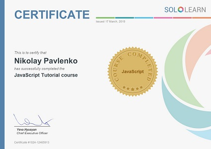
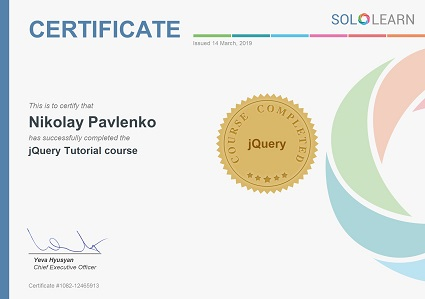

### Contact info:
 1. Nikolay Pavlenko
 2. Contacts
    * Phone number : +375257837931
    * Telegram: @lomprotivshokera
    * Email: nipalenko@gmail.com
 3. My goal is to become part of the IT community in EPAM company. 
 I want to take part in projects that will increase my level in development. Everyday I work on my own project and improve my developer skills.
 At the last month i take a freelance projects in [Kwork](https://kwork.ru "It is not link to my profile :)").
 Also I want to improve my english conversation level. To do this, i visit several clubs in which people communicate each other in English.
 
 4. I have a little experience in HTML, CSS3, Bootstrap3,4, Javascript (jQuery), PHP, SQL. And some CMS like Wordpress, Joomla. Also i worked with AWS and Google cloud platform.
 I have experience in setup Nginx and Apache2 from scratch.
 
 5. Exmaple
    ```javascript
    
    /**
    This function iterates over the array received from the database.
    Based on the obtained values, sets checkboxes in the table cells
    loaData s an array obtained from the database
    */
    
    var exploded;
    var loadData;
    
    loadData =  <?php echo(json_encode($dataFromDb)); ?>;
  
    $.each(loadData,function(index,value){
        if (index === 'id' || index === 'login' || !value) {
                return;
    }
    
        exploded = value.split(',');
        
        for (i = 0; i < exploded.length; i++) {
            $('tbody th').filter(function(){
    
                if($(this).attr('columnNumber') === index){
                    $(this).parent().find('input[week-data='+exploded[i]+']').prop('checked', true);
                }
            })
        }
    });
    ```
   6. As I sad, I have a little experience in freelance projects. This is link on my profile in kwork:
      * [NikolayPavlenko](https://kwork.ru/user/nikolaypavlenko "Now, it is link to my profile :)")
   
   7. Certificates from courses:
      * Sololearn
      
         
         
   
   8. When was the last time I pass English level test I had A2+ mark. 
      But from this time I try to improve my English conversation and grammar level.
      I visit English conversation club, use an app called grammar and watch videos in English.
  
       
     


